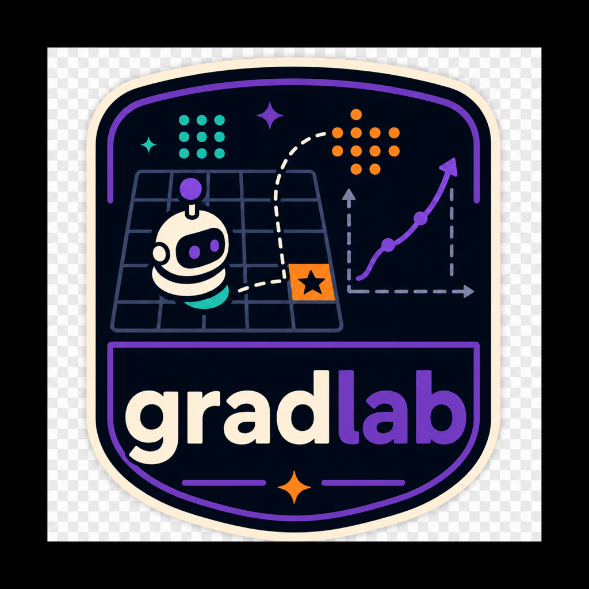
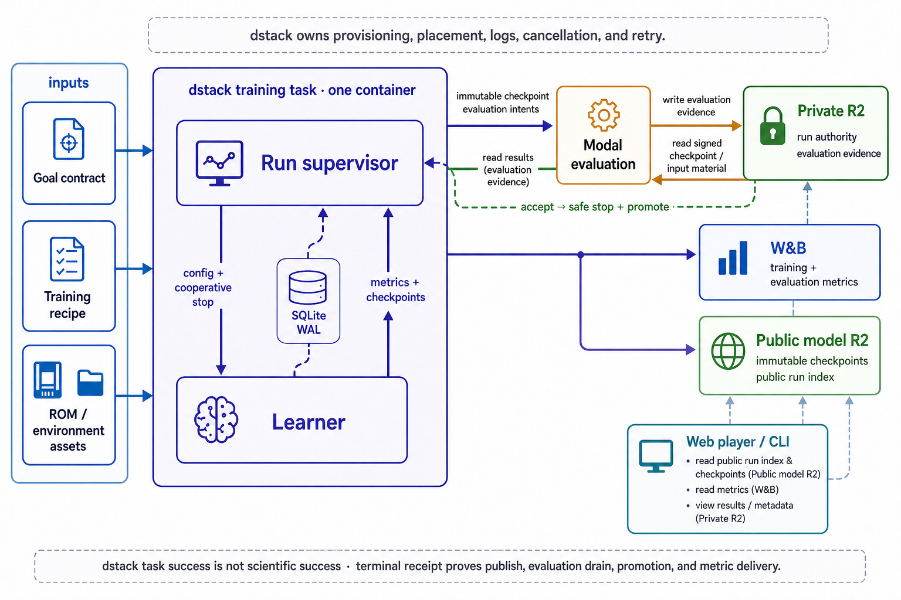

<div align="center">
  

  **🤖 RL workbench for training game agents 🎮**
</div>

GradLab is a Python CLI and reproducible reinforcement-learning workbench for
researchers who train, evaluate, compare, inspect, and publish game agents. It
turns versioned goal contracts and recipes into traceable local or queued runs,
with portable policies and evidence-backed results.

Try the bundled ROM-free smoke recipe without cloning, credentials, or a ROM:

```bash
uvx gradlab@0.1.1 train gradlab__bandit/ppo
```

The run writes a directly playable policy below `~/.config/gradlab/runs/`.

## Install

[Install uv](https://docs.astral.sh/uv/getting-started/installation/), then run:

```bash
git clone https://github.com/tsilva/gradlab.git
cd gradlab
./install.sh
gradlab validate
```

Run `gradlab --help` to open the command reference, or train and play the
bundled smoke recipe:

```bash
gradlab train gradlab__bandit/ppo
gradlab play --recipe gradlab__bandit/ppo
```

`gradlab play` starts the local web player and prints its loopback URL.

## Gymnasium classic control

GradLab includes strict Turbo-vector goals for Gymnasium's current discrete
classic-control environments:

```bash
gradlab train CartPole-v1/ppo
gradlab train MountainCar-v0/ppo
gradlab train Acrobot-v1/ppo
```

Their qualified environment IDs are `gymnasium:CartPole-v1`,
`gymnasium:MountainCar-v0`, and `gymnasium:Acrobot-v1`. They use isolated
spawned lanes, explicit masked resets, native rewards, and RGB rendering through
the same training, evaluation, publication, and playback workflows as other
GradLab providers.

## Commands

```bash
gradlab train <goal>/<recipe>       # train a checked-in recipe locally
gradlab play [artifact]             # browse or inspect local and remote policies
gradlab validate                    # validate goals, recipes, benchmarks, and ops config
gradlab env list                    # list available environment providers
gradlab rom status --json           # inspect registered ROM assets
gradlab benchmark list              # list reproducible benchmark profiles
gradlab experiment status --run ID  # inspect an orchestrated run
uv run pytest                       # run Python tests
uv run ruff check .                 # lint Python code
pnpm test:web                       # run web-player tests
```

Use `gradlab <command> --help` for full arguments. Gameplay datasets, leader
queries, W&B reports, and workspace management are also available through the
`dataset`, `leaders`, `reports`, and `workspaces` commands.

## Research results

Start with [Featured Research on Hugging Face](https://huggingface.co/collections/tsilva/gradlab-featured-research-6a76017e31c4e6f8fd5593f3)
or its [YouTube playlist](https://www.youtube.com/playlist?list=PLKUQZsKUoinA).

Environment indexes:

- [VizdoomDeathmatch-v1 models](https://huggingface.co/collections/tsilva/gradlab-vizdoomdeathmatch-v1-6a75be1f7f77460f66953c43)
  and [videos](https://www.youtube.com/playlist?list=PLbd2wb1agDJ0)
- [SuperMarioBros-Nes-v0 models](https://huggingface.co/collections/tsilva/gradlab-supermariobros-nes-v0-6a5675af108d798040f3aafb)
  and [videos](https://www.youtube.com/playlist?list=PLpwSvrlUj8-ISJH2ptsalWqNc8dc6N5Hi)

Evaluation evidence and representative replay are distinct: immutable model
tags contain the accepted evaluation record, while videos show one separately
labeled episode.

## Queued runs

Queued training uses dstack for placement, a single supervisor-controlled
training container, Modal for separately scheduled checkpoint evaluation, R2
for run authority and artifacts, and W&B for metrics.

Copy the portable operator template into private user configuration and run the
read-only preflight before launching:

```bash
mkdir -p ~/.config/gradlab
install -m 600 ops/operator.example.toml ~/.config/gradlab/operator.toml
gradlab experiment operator-preflight --json
```

Then launch a checked-in goal and recipe with a finite duration and a specific
description:

```bash
gradlab experiment launch \
  --goal-file experiments/goals/SuperMarioBros-Nes-v0/Level1-1/_goal.yaml \
  --recipe-file experiments/goals/SuperMarioBros-Nes-v0/Level1-1/recipes/ppo.yaml \
  --seed 123 \
  --run-description "Mario Level1-1 PPO seed 123" \
  --compute local \
  --max-duration 48h \
  --json
```

Local compute requires an enrolled fleet in
`~/.config/gradlab/instances.md`. Paid cloud compute is always bounded and
explicitly authorized. See [COMPUTE.md](COMPUTE.md) and the
[dstack runbook](ops/dstack/README.md) before operating queued runs.

## Notes

- GradLab requires Python 3.14 and uses `uv` with a committed lockfile and a
  seven-day dependency age gate. Supported binary targets are macOS arm64 and
  Linux x86_64.
- Local `gradlab train` runs disable W&B and checkpoint evaluation by default.
  They are training-only and cannot establish goal acceptance or checkpoint
  promotion.
- `gradlab.ppo` is the opt-in tensor-native PPO backend. It accepts the
  `sb3.ppo` configuration surface plus `precision` (`fp32`, `amp-fp16`, or
  `amp-bf16`) and an `execution_profile`. `sb3-parity` preserves SB3's eager,
  unfused, environment-major minibatch path; `compiled-parity` and
  `compiled-fused-parity` isolate the CUDA optimizations; `max-throughput`
  additionally uses GPU-native permutation and is the default. The backend
  keeps PPO artifacts mutually resumable with SB3 and uses eager execution on
  CPU or MPS. Checked-in
  training recipes remain on `sb3.ppo` until the dedicated RTX 4090 throughput
  gate passes.
- NES recipes require a lawfully obtained ROM supplied with `--rom-path` or
  registered with `gradlab rom sync`. ROMs and credentials must remain outside
  source control.
- Generated runs default to `~/.config/gradlab/runs/`; other generated logs and
  models belong in ignored `logs/` and `models/` directories.
- dstack task success is not scientific success. A queued run succeeds only
  when its terminal receipt proves checkpoint publication, evaluation drain,
  promotion state, and metric delivery.
- [SPECS.md](SPECS.md) defines product requirements, [METRICS.md](METRICS.md)
  defines metric semantics, and [experiments/README.md](experiments/README.md)
  explains the checked-in research contracts.

## Architecture



## License

GradLab is licensed under the [MIT License](LICENSE). Third-party attributions
are listed in [THIRD_PARTY_NOTICES.md](THIRD_PARTY_NOTICES.md).
